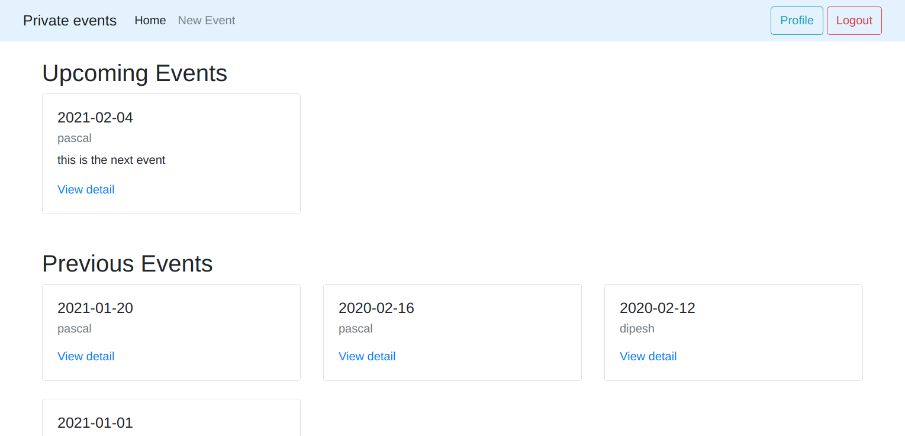

# Private Events

In this project we created a private events web application where;

- A user can create an event

- A user can attend many events

- An event can be attended by many users.



### Built with

* Ruby on Rails
* Bootsrap
* Rubocop
* VsCode


<!-- ## Live Demo

[Live demo link](https://stark-refuge-03764.herokuapp.com/) -->
### Getting started

To get started, you should first get this file in your local machine by cloning or forking this project or typing in your terminal

```
git clone https://github.com/dipbazz/private_events.git
```


### Prerequisites

Before you start using the applicatiob, you need to be sure that you have Ruby installed on your computer, by typing.

```
ruby -v
```

You should see your version ofruby.

If it's not installed in your system, follow this [guide](https://www.ruby-lang.org/en/documentation/installation/) and it will help you to get it done.

Then you can install rails using this command,

```
gem install rails
```
And you can also check your rails version by typing in your terminal

```
rails -v
```

After that do bundle install to install all required gems and dependences
```
bundle install
```
Database migration

```
rails db:migrate
```
 Open the rails Server in your terminal
 ```
 rails s
 ```
Go to [localhost:3000](http://localhost:3000) in your browser

You can then log in and start creating and attending events :blush:

### Authors:

 **Pascal Byabasaija**
- Linkedin: [Pascal Byabasaija](https://www.linkedin.com/in/pascal-byabasaija/)
- Github: [@Byabasaija](https://github.com/Byabasaija)
- Twitter: [@byabashaijapoet](https://twitter.com/byabashaijapoet)

**Dipesh Bajgain**
- GitHub: [@dipbazz](https://github.com/dipbazz)
- Twitter: [@dipbazz](https://twitter.com/dipbazz)
- LinkedIn: [Dipesh Bajgain](https://www.linkedin.com/in/dipbazz/)

### Acknowledment

 Odin Project

### Contributions

Contributions, issues and requests are welcome :tada:

### Show support

Give a star :star: if you like the project 

